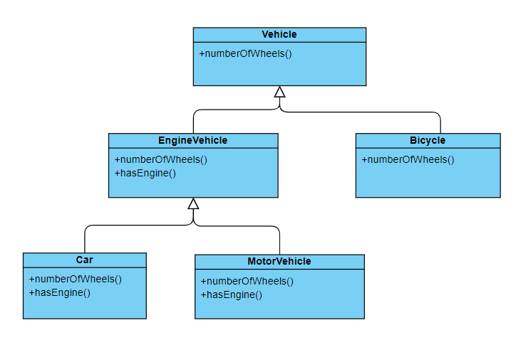

# Liskov Substitution Principle (LSP)

The Liskov Substitution Principle states that objects of a superclass should be replaceable with object of a subclass without affecting the correctness of the program.

If s is the subclass of T, then objects of type T should be replaceable with objects of type S without alterning the desirable properties of the program (correctness, task performed etc.)

## Why Need LSP:

- **Maintainability**: Ensuring that subcalsses can be substituted for their base classes without issues makes the system easier to understand and maintain
- **Reusability**: Following LSP ensures that code relying on base classes can also work with any derived class, increasing code reuse.
- **Robustness**: LSP prevent unexpected behavior and bugs when subclasses are used in place of base classes.
- **Flexibility**: It allows polymorphic behavior to be implemented correctly, ensuring that new subclasses can be integrated smoothly without modifying existing code.

## Without LSP:

```cpp

class Vehicle
{
    public:
        virtual int numberOfWheels(){
            return 4;
        }

        virtual void hasEngine(){
            cout<<"Has 4 Cylinder Engine"<<endl;
        }

        virtual ~Vehicle(){
            cout<<"dtor..." <<endl;
        }
};

class Car : public Vehicle
{
    public:
        virtual int numberOfWheels() override {
            return 4;
        }

        virtual void hasEngine() override {
            cout<<"Has 4 Cylinder Engine"<<endl;
        }
};

class MotorCycle : public Vehicle
{
    public:
        virtual int numberOfWheels() override {
            return 2;
        }

        virtual void hasEngine() override {
            cout<<"Has 2 Cylinder Engine"<<endl;
        }
};

class Bicycle : public Vehicle
{
    public:
        virtual int numberOfWheels() override {
            return 2;
        }

        virtual void hasEngine() override {
            throw "No Engine";
        }

};

int main()
{
    Vehicle *p = new Car();
    p->hasEngine();

    p = new MotorCycle();
    p->hasEngine();

    p = new Bicycle();
    p->hasEngine();

    return 0;
}

```

The above program thow error when we replace Bicycle object to base class Vehicle.

## With LSP

```cpp

class Vehicle
{
    public:
        virtual int numberOfWheels(){
            return 4;
        }

        virtual ~Vehicle(){
            cout<<"dtor..." <<endl;
        }
};

class EngineVehicle : public Vehicle
{
    public:
         virtual void hasEngine(){
            cout<<"Has 4 Cylinder Engine"<<endl;
        }
};


class Car : public EngineVehicle
{
   public:
        virtual int numberOfWheels() override {
            return 4;
        }

        virtual void hasEngine() override {
            cout<<"Has 4 Cylinder Engine"<<endl;
        }
};

class MotorCycle : public EngineVehicle
{
    public:
        virtual int numberOfWheels() override {
            return 2;
        }

        virtual void hasEngine() override {
            cout<<"Has 2 Cylinder Engine"<<endl;
        }
};

class Bicycle: public Vehicle
{
    public:
        virtual int numberOfWheels() override {
            return 2;
        }
};

int main()
{
    EngineVehicle *p = new Car();
    p->hasEngine();

    p = new MotorCycle();
    p->hasEngine();

    //p = new Bicycle();  Compilation Error
    //p->hasEngine();

    Vehicle *q = new Bicycle();
    q->numberOfWheels();

    return 0;
}

```

In the above code we can easily replace subcalsss object to superclass object, and program behave correctly.


