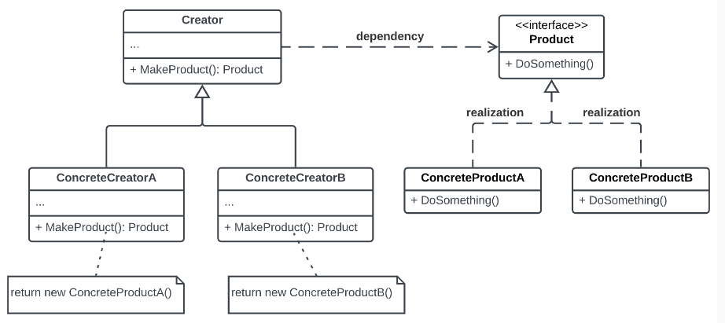

# Factory Method Design Pattern

- The factory method design pattern is a creational design pattern that provides an interface for creating objects in a superclass but allows subclasses to alter the type of objects that will be created.

- It defines an interface for creating an object but the subclass decides which class to instantiate.

- The factory method pattern is a way of creating objects, but letting subclasses decide exactly which class to instantiate.

## Factory Method solves following common problems

**1) Encapsultion of Object Creation:** It encapsulates the object creation logic within a separate method or class, decoupling the client code from the specific classes of objects it needs to create. This allows more flexible and maintanable code, as clients don't need to be aware of the concrete classes of objects they are using.

**2) Code Duplication:** It helps to avoid code duplication by centralizing the object creation logic in a single location, instead of duplicating the same object creation code across multiple places.

**3) Dependency Inversion:** It promotes dependency inversion by allowing clients to depend on abstractions rather than concrete implementations.

# UML Diagram




# Implementation

```cpp

#include <iostream>
#include <string>

using namespace std;


struct IDatabase
{
    virtual string GetConnectionString() = 0;
    virtual ~IDatabase() {}
};

class MySQLDatabse : public IDatabase
{
public:

    string GetConnectionString()
    {
        return "MySQL DB ConnectionString";
    }

    ~MySQLDatabse() {}

};

class SQLServerDatabse : public IDatabase
{
public:
    string GetConnectionString()
    {
        return "SQLServer DB ConnectionString";
    }

    ~SQLServerDatabse() {}
};

class MongoDB : public IDatabase
{
public:
    string GetConnectionString()
    {
        return "MongoDB ConnectionString";
    }

    ~MongoDB() {}
};

class Neo4jGraphDB : public IDatabase
{
public:
    string GetConnectionString()
    {
        return "Neo4jGraph DB ConnectionString";
    }
    ~Neo4jGraphDB() {}
};

class DBFactoryClass
{
public: 

    virtual IDatabase* CreateObject() = 0;
    virtual ~DBFactoryClass() {};
};

class MySQLFactoryClass : public DBFactoryClass
{

public:
    IDatabase* CreateObject()
    {
        return new MySQLDatabse();
    }

    ~MySQLFactoryClass()
    {
        
    }
};

class SQLServerFactoryClass : public DBFactoryClass
{
public:
    IDatabase* CreateObject()
    {
        return new SQLServerDatabse();
    }

    ~SQLServerFactoryClass()
    {

    }
};

class MongoDbFactoryClass : public DBFactoryClass
{
public:
    IDatabase* CreateObject()
    {
        return new MongoDB();
    }

    ~MongoDbFactoryClass()
    {

    }
};

class Neo4jGraphDBFactoryClass : public DBFactoryClass
{
public:
    IDatabase* CreateObject()
    {
        return new Neo4jGraphDB();
    }

    ~Neo4jGraphDBFactoryClass()
    {

    }
};

int main()
{
    DBFactoryClass* pFactory = nullptr;
    IDatabase* pDB;

    pFactory = new MySQLFactoryClass();
    pDB = pFactory->CreateObject();
    cout << pDB->GetConnectionString() << endl;

    pFactory = new Neo4jGraphDBFactoryClass();
    pDB = pFactory->CreateObject();
    cout << pDB->GetConnectionString() << endl;

    pFactory = new MongoDbFactoryClass();
    pDB = pFactory->CreateObject();
    cout << pDB->GetConnectionString() << endl;

    delete pDB;
    delete pFactory;
}

```
